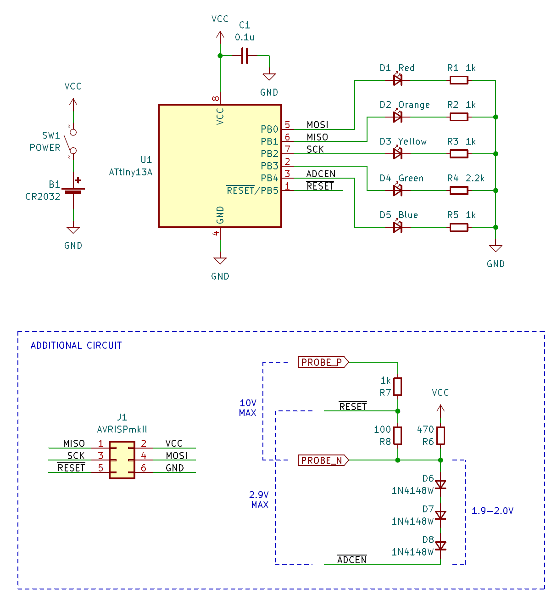

# smdc-mod-battery-checker

[#SMD_Challenge](https://x.com/search?q=%23SMD_Challenge) の [基板](https://dominotech.blogspot.com/2024/08/smd-challenge-badge.html) を電池チェッカーに改造してみました。

## 機能

- プローブに接続された電池の残量を LED 5 個 x 点滅 4 段階 = 20 段階でレベル表示します。
- 1.5V、3V、3.7V、9V を判別し、それぞれの電圧範囲に応じてレベル表示します。
- プローブが開放状態のときは、起動後 3 秒間は自分自身の電池の電圧をレベル表示し、その後は元の SMD Challenge 基板と同様のアニメーションを表示します。

## 回路

## 仕組み

空き端子となっていた PB5 (RESET) に追加の回路を接続し、PB5/RESET と兼用の ADC0 を使って電圧を測定します。

PB5 にそのままアナログ電圧を入力すると電圧によってはリセットがかかってしまうので、1N4148W の順方向電圧降下 (Vf) x3 で 2V 程度の下駄を履かせ、そこを基準 (0V) として測定します。9V まで測定できるよう、抵抗分圧して入力しています。

1N4148W のカソードをそのまま GND に落とすと起動時の PB5 の電圧がリセット閾値の上限 (0.9Vcc) を下回ってしまいリセットが解除されない可能性があるため、GND ではなく PB4 に接続し、ADC0 を使う間は Low にドライブします。2V 程度ではリセットがかからないことを期待しています。

1N4148W の Vf は Vcc 電圧や環境温度で変動するため、起動時にプローブがオープンの状態で ADC 値を読み取り、1N4148W の I-V 特性から Vf と Vcc を推定します。Vcc や環境温度は時間とともに変化するため、プローブがオープンのときに定期的に更新します。

プローブに電池が接続されたときは Vf～Vcc の範囲をプローブ間の電圧に線形変換します。

## ダメなところ

- ATtiny13A のリセットの閾値電圧はデータシート上は 0.2Vcc ～ 0.9Vcc の範囲のどこかなので、そもそも使い方として正しくない。
- 1N4148W の個体差、Vcc 電圧、環境温度、PB4 の Low 電圧等の影響を受けるためデリケートすぎる。

## 動作の様子

→ [x.com](https://twitter.com/shapoco/status/1860731428079857833)

----
